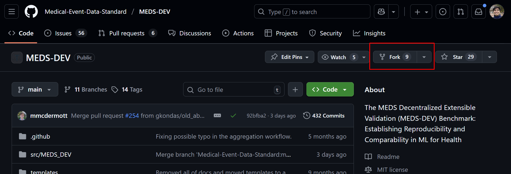
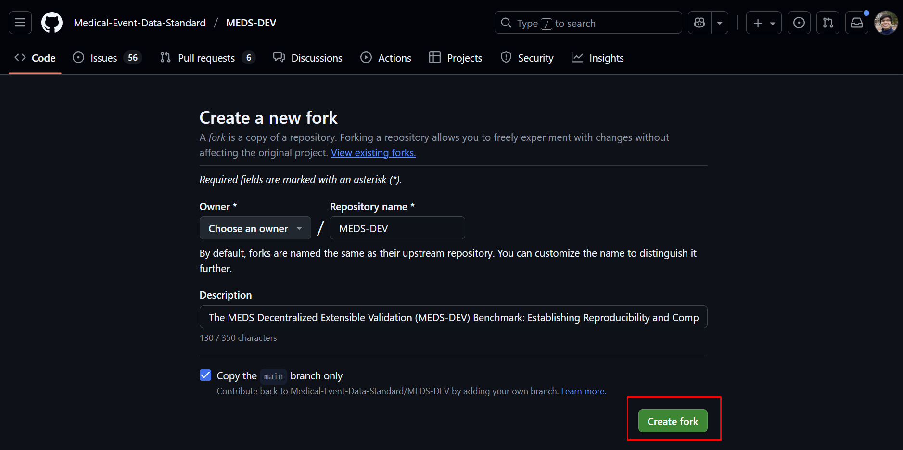
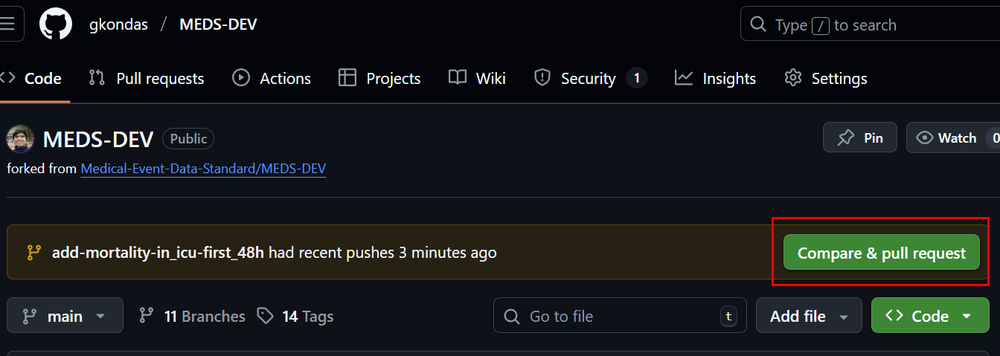
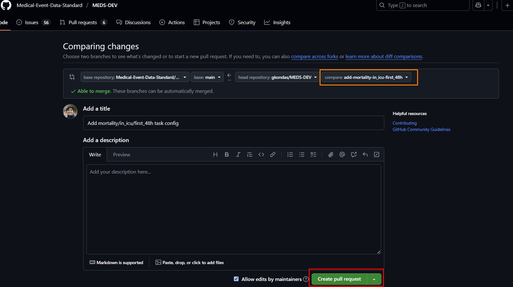

# How to add a task to MEDS-DEV

## Overview
To add a task to MEDS-DEV, you must first have your task defined in an ACES configuration `task_name.yaml` file. To learn how to define your task in as an ACES config, please refer to the ACES [tutorial](https://eventstreamaces.readthedocs.io/en/stable/notebooks/tutorial_meds.html#Configuration-File). You should also create an associated `README.md` explaining the task. This guide will assume you already have both of these and now want to contribute them to MEDS-DEV for others in the Health AI community to use. For this tutorial, we will add the `mortality/in_icu/first_48h` task to MEDS-DEV. 

## Walkthrough
### 1. Create a personal fork of the MEDS-DEV repo


### 2. Clone your personal fork to your machine using ssh or https:
```bash
# Using HTTPS:
git clone https://github.com/{$GITHUB_USERNAME}/MEDS-DEV.git

# Using SSH:
git clone git@github.com:{$GITHUB_USERNAME}/MEDS-DEV.git
```

Once cloned, it's helpful to also add the official MEDS-DEV repository as an upstream remote so you can pull future updates.
```bash
# (Optional but recommended)
cd MEDS-DEV
git remote add upstream https://github.com/Medical-Event-Data-Standard/MEDS-DEV

# Verify your remotes
git remote -v

```
### 3. Create a new branch on your fork
Before adding your config file, create a new branch for your task. This keeps your changes organized and prevents modifying your main branch directly. It’s best practice to name the branch after the task you’re adding.
```bash
cd MEDS-DEV
git checkout -b add_mortality_in_icu-first_48h
```


### 4. Add your config file to the local MEDS-DEV repo
You must now copy your config file into the MEDS-DEV file structure on your local machine. Given that we are adding the `mortality/in_icu/first_48h` task, we’ll copy our ACES config to the directory `MEDS-DEV/src/MEDS_DEV/tasks/mortality/in_icu/`. If you are creating a task that you feel doesn't fit neatly into any of the current folders, feel free to add your own folder inside `MEDS-DEV/src/MEDS_DEV/tasks`. Please remember to substitute the correct `local_user_path` to be whatever the path to your config file is on your machine.
```bash
# Ensure the folder we are copying the config to exists
export DEST="src/MEDS_DEV/tasks/mortality/in_icu/"
mkdir -p "$DEST"

# Copy the config into local MEDS-DEV
export CONFIG_FP="/local_user_path/first_48h.yaml"
cp "$CONFIG_FP" "$DEST"
```
Your ACES config should now appear in the `DEST` folder (in this case, `MEDS-DEV/src/MEDS_DEV/tasks/mortality/in_icu/`). You can verify it with:
```bash
ls "$DEST"
```

### 5. Push your changes to your personal fork
Once your config file has been added, commit and push your changes to your forked repository.
```bash
# Stage the new config file
git add src/MEDS_DEV/tasks/mortality/in_icu/first_48h.yaml

# Commit the change
git commit -m "Add mortality/in_icu/first_48h task config"

# Push the branch to your fork
git push origin add-mortality-in_icu-first_48h
```

### 6. Open a pull request to the official MEDS-DEV repository
After pushing your local changes to your fork, you should now be able to use the online github GUI to open a Pull Request to the official MEDS-DEV repo with your changes. To do so, navigate to your fork on github, and click "Compare & pull request" as shown here:

Next, ensure that you're merging the correct branch as shown in the orange box below. Finally, click "Create pull request" to submit your task to MEDS-DEV!


### Congragulations!
You’ve successfully added a new task to MEDS-DEV and contributed to the open source Health AI community!