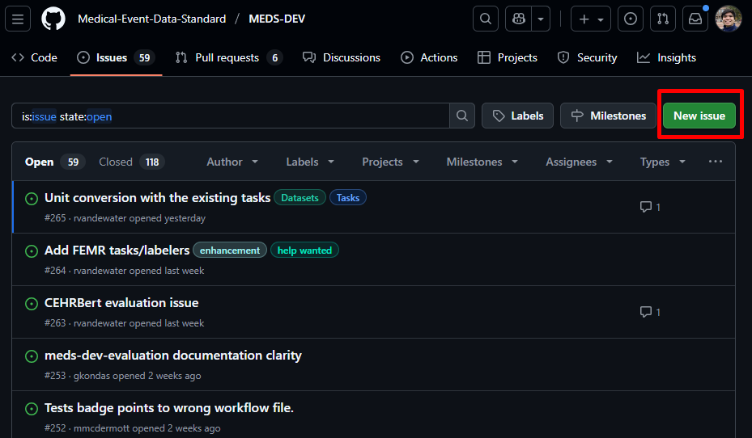
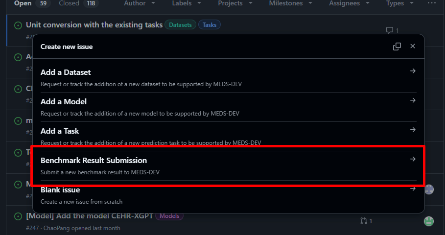
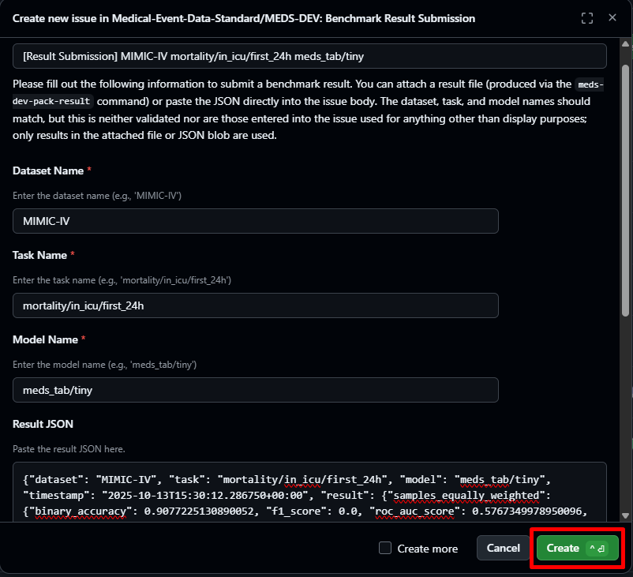

# How to add a benchmark result to MEDS-DEV
## Overview
This tutorial assumes that you have a results.json file created with meds-dev-evaluation and now want to add this result to the official MEDS-DEV online benchmark.

## Walkthrough
### 1. Package your results.json into a packed_results.json by running the following command

```bash
meds-dev-pack-result \
    dataset=$DATASET_NAME \
    task=$TASK_NAME \
    model=$MODEL_NAME \
    evaluation_fp=$PATH_TO_MODEL/evaluation/results.json \
    results_fp=$PATH_TO_MODEL/results/packed_results.json
```

### 2. Copy packed_results.json to clipboard
After running the command above, you should now see a file called `packed_results.json` inside your model's `results/` directory. This file contains a summary of your evaluation results that MEDS-DEV uses for benchmarking.
Next you must:
- Open the `packed_results.json` file in your text editor
- Copy its entire contents (the full JSON text) to your clipboard

### 3. Open a Github issue on MEDS-DEV repo
Go to the MEDS-DEV Github [issues page](https://github.com/Medical-Event-Data-Standard/MEDS-DEV/issues) and open an issue, selecting the "Benchmark Result Submission" issue template as shown below:




### 4. Input benchmark result information, and submit!
First, paste in the packed_results.json contents into the `Result JSON` text box. Next, fill in the correct dataset, task, and model name. Finally, name your benchmarksubmission something informative. After filling in all of the information, click `Create` in the bottom right corner.




### Congragulations! 
You have official submitted a benchmark result to MEDS-DEV and contributed to the open source Health AI community! You can view your benchmark results and how it compares to others on the official MEDS-DEV benchmark [webpage](https://medical-event-data-standard.github.io/docs/MEDS-DEV/benchmark).

